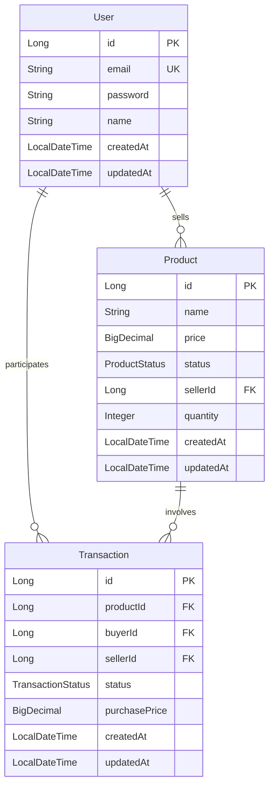

# 개발 로그

## 1. 프로젝트 설계 단계 (2024-03-02)

### 1.1 ERD 설계
첫 번째로 프로젝트의 ERD를 설계했습니다. 주요 엔티티는 다음과 같습니다:

### 1.2 테스트 계획
테스트는 다음과 같은 전략으로 진행할 예정입니다:

1. **커버리지 목표**
   - 전체 코드 커버리지 80% 이상 달성
   - 중요 비즈니스 로직(거래 처리, 결제 등)은 100% 커버리지 목표
   - 도메인 엔티티의 유효성 검증 로직 100% 커버리지

2. **테스트 종류**
   - 단위 테스트
     * 엔티티 유효성 검증
     * 비즈니스 로직 검증
     * Repository 쿼리 테스트
   - 통합 테스트
     * API 엔드포인트 테스트
     * 트랜잭션 처리 테스트
   - 성능 테스트
     * 동시성 테스트 (여러 사용자가 동시에 구매 시도)
     * API 응답 시간 벤치마크

3. **보안 테스트**
   - 인증/인가 테스트
   - 입력값 검증 테스트
   - SQL 인젝션 방지 테스트
   - 패스워드 암호화 검증

## 2. 엔티티 구현 (2024-03-02)

### 2.1 BaseEntity 구현
공통으로 사용할 BaseEntity를 구현했습니다:
- `@MappedSuperclass`를 사용하여 상속 구조 구현
- `@EntityListeners(AuditingEntityListener.class)`를 통해 생성/수정 시간 자동화
- createdAt, updatedAt 필드 추가

### 2.2 User 엔티티 구현
사용자 정보를 저장할 User 엔티티를 구현했습니다:
- 테이블명을 'users'로 지정 (user는 예약어인 경우가 많음)
- email에 unique 제약조건 추가
- 유효성 검증 어노테이션 추가 (@Email, @NotBlank, @Size)
- Builder 패턴 적용
- 비밀번호 암호화는 서비스 레이어에서 처리 예정

### 2.3 Product 엔티티 구현
제품 정보를 저장할 Product 엔티티를 구현했습니다:
- 판매자와 ManyToOne 관계 설정 (fetch = LAZY)
- ProductStatus enum으로 상태 관리 (ON_SALE, RESERVED, COMPLETED)
- 가격은 BigDecimal 사용 (금액 계산의 정확성을 위해)
- quantity는 2단계 요구사항이지만 미리 포함
- 상태 변경과 수량 변경을 위한 메서드 추가
- 인덱스 추가 (상태, 판매자)
- 유효성 검증 로직 추가 (가격, 수량)

### 2.4 Transaction 엔티티 구현
거래 정보를 저장할 Transaction 엔티티를 구현했습니다:
- 제품, 구매자, 판매자와 ManyToOne 관계 설정 (fetch = LAZY)
- TransactionStatus enum으로 상태 관리 (REQUESTED, APPROVED, CONFIRMED, COMPLETED)
- purchasePrice 필드로 구매 시점의 가격 저장 (가격 변동에 대응)
- 구매자/판매자 확인을 위한 유틸리티 메서드 추가
- 입력값 검증 로직 추가 (가격, 참여자)
- null 체크 추가로 안정성 향상
- 인덱스 추가 (상품, 구매자, 판매자, 상태)