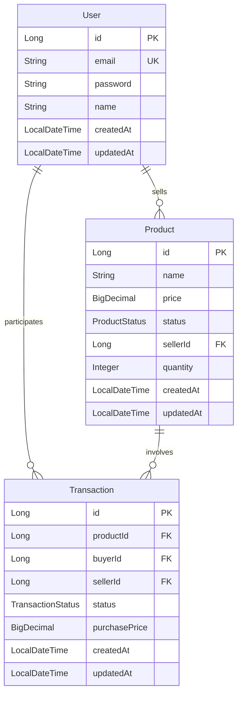

# 개발 로그

## 1. 프로젝트 설계 단계 (2024-03-02)

### 1.1 ERD 설계
첫 번째로 프로젝트의 ERD를 설계했습니다. 주요 엔티티는 다음과 같습니다:

#### ERD 설계 시 고려사항
1. **User (사용자)**
   - 이메일을 유니크 키로 설정하여 로그인 식별자로 사용
   - 기본적인 회원 정보만 포함하여 설계

2. **Product (제품)**
   - 판매자 정보를 FK로 연결
   - 상태값을 enum으로 관리 (판매중, 예약중, 완료)
   - 2단계 요구사항을 고려하여 quantity 필드 추가

3. **Transaction (거래)**
   - 구매자, 판매자, 제품 정보를 모두 FK로 연결
   - 구매 시점의 가격을 별도로 저장하여 가격 변동에 대응
   - 거래 상태를 enum으로 관리

### 1.2 개발 계획

#### 1단계 (필수 구현)
1. **기본 인프라 설정**
   - [x] BaseEntity 구현
   - [ ] Security 설정
   - [ ] JWT 인증 구현
   - [ ] 예외 처리 구현

2. **회원 기능**
   - [x] 회원 엔티티 구현
   - [ ] 회원가입 API
   - [ ] 로그인 API

3. **제품 기능**
   - [x] 제품 엔티티 구현
   - [ ] 제품 등록 API
   - [ ] 제품 조회 API (목록/상세)
   - [ ] 제품 상태 관리

4. **거래 기능**
   - [x] 거래 엔티티 구현
   - [ ] 구매 신청 API
   - [ ] 판매 승인 API
   - [ ] 거래 내역 조회 API

#### 2단계 (선택 구현)
5. **수량 관리 기능**
   - [ ] 제품 수량 관리
   - [ ] 다중 구매 처리
   - [ ] 구매 확정 프로세스

6. **가격 이력 관리**
   - [ ] 구매 시점 가격 저장
   - [ ] 가격 변동 대응

### 1.3 테스트 계획
- 각 기능별 단위 테스트 작성
- 주요 비즈니스 로직에 대한 통합 테스트 작성
- API 엔드포인트에 대한 테스트 작성

## 2. 엔티티 구현 (2024-03-02)

### 2.1 BaseEntity 구현
공통으로 사용할 BaseEntity를 구현했습니다:
- `@MappedSuperclass`를 사용하여 상속 구조 구현
- `@EntityListeners(AuditingEntityListener.class)`를 통해 생성/수정 시간 자동화
- createdAt, updatedAt 필드 추가

### 2.2 User 엔티티 구현
사용자 정보를 저장할 User 엔티티를 구현했습니다:
- 테이블명을 'users'로 지정 (user는 예약어인 경우가 많음)
- email에 unique 제약조건 추가
- Builder 패턴 적용
- 비밀번호 암호화는 서비스 레이어에서 처리 예정

### 2.3 Product 엔티티 구현
제품 정보를 저장할 Product 엔티티를 구현했습니다:
- 판매자와 ManyToOne 관계 설정
- ProductStatus enum으로 상태 관리 (ON_SALE, RESERVED, COMPLETED)
- 가격은 BigDecimal 사용 (금액 계산의 정확성을 위해)
- quantity는 2단계 요구사항이지만 미리 포함
- 상태 변경과 수량 변경을 위한 메서드 추가

### 2.4 Transaction 엔티티 구현
거래 정보를 저장할 Transaction 엔티티를 구현했습니다:
- 제품, 구매자, 판매자와 ManyToOne 관계 설정
- TransactionStatus enum으로 상태 관리 (REQUESTED, APPROVED, CONFIRMED, COMPLETED)
- purchasePrice 필드로 구매 시점의 가격 저장 (가격 변동에 대응)
- 구매자/판매자 확인을 위한 유틸리티 메서드 추가
- FetchType.LAZY로 지연 로딩 설정하여 성능 최적화